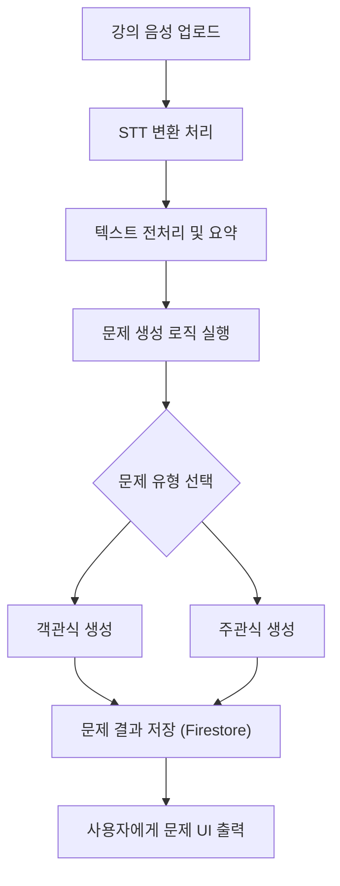

# 1. 개요
---
- **프로젝트명**: 세컨드 티처 (Second Teacher)
- **목표**: 강의 데이터 기반으로 시험 문제를 생성하여
	- **교수자**는 **간편하게 시험 문제를 생성**할 수 있고
	- **학생**은 **기출 기반 학습 자료**를 통해 **시험을 효율적으로 준비**할 수 있음.
- **수행기간**: 2025.04.25 ~ 2025.05.16 (3주)
- **사용 기술**: Python, Flask, Firebase Firestore, 외부 STT API
- **팀원 및 역할**:
  - **이수영**: 프론트엔드 개발, 발표자료 작성 (팀장이라 볼드 표시)
  - 임기홍: DB 및 API 연동, 문서 작성
  - 임상혁: 백엔드 개발, GitHub 관리

# 2. 주요 기능
---

| 구분        | 기능명           | 설명                                   |
| --------- | ------------- | ------------------------------------ |
| 🔊 음성 인식  | 강의 음성 입력      | 강의 음성 파일을 STT를 이용해 텍스트로 변환           |
| 🧠 데이터 처리 | 교안 + 음성 통합 학습 | 텍스트와 강의자료(교안)를 분석하여 학습               |
| 📝 문제 생성  | 예상문제 자동 생성    | 학습된 내용을 기반으로 템플릿 기반 객관식/주관식 문제 자동 생성 |
| 🖥️ 프론트엔드 | 문제 UI 제공      | 사용자 인터페이스에서 문제 확인 및 제출 가능            |
| ⚙️ 백엔드    | 문제 생성 로직 처리   | 텍스트 처리, 문제 템플릿 매칭, 생성 로직 구현          |
| 💾 DB 연동  | 학습 데이터 저장     | Firestore 기반으로 생성된 문제 및 학습 데이터 저장/조회 |

# 3. 기술 스택 및 상세 기능 (분류 통합)

## 🔧 **Backend**

- **사용 기술**: Python, Flask
- **주요 기능**:
    - 음성 파일 STT 변환 처리
        - Google STT API 등 외부 음성 인식 API 사용
        - 예외 처리: 음질 저하 시 오류 메시지 출력
    - 문제 자동 생성
        - 방식: 템플릿 매칭 + 자연어 처리
        - 문제 형태: 객관식, 주관식
    - API 연동 및 백엔드 로직 처리 전반

---

## 🎨 **Frontend**

- **사용 기술**: HTML / CSS / JS 기반 (React 스타일 포함 가능)
- **주요 기능**:
    - 문제 표시 UI
    - 문제 제출 인터페이스
    - 반응형 UI 구현

---

## 🗂 **Database**

- **사용 기술**: Firebase Firestore
- **주요 기능**:
    - 문제 및 사용자 기록 저장
    - 스키마 예시:
        - `lectures/{lecture_id}/questions/{question_id}`
        - `users/{user_id}/records/`

# 4. 시스템 플로우차트
---

# 5. 개발 일정 및 진척도
---

| 항목       | 1주차 | 2주차 | 3주차 |
|------------|-------|-------|-------|
| 프론트엔드 | 10%   | 50%   | 100%  |
| 백엔드     | 30%   | 70%   | 100%  |
| DB 연동    | 20%   | 100%  | 100%  |
| API 연동   | 30%   | 50%   | 100%  |

# 6. 협업 전략
---
- 실시간 소통: **Discord**, **KakaoTalk**
- 코드 관리: **GitHub**
- 문서 작성: **Google Docs**, **Obsidian**
- 회의: 주 1회 디스코드 회의 + 주기적 코드 업데이트

# 7. 예상 리스크 및 대처
---

| 문제점 | 해결 방안 |
|--------|------------|
| STT 인식률 낮음 | 음성 품질 전처리 / STT API 교체 고려 |
| 강의자료 형식 다양성 | 최소 기준 가이드라인 마련 |

---
## 🔹 1. 기획 및 자료 준비
- [ ] 자료 수집
	- [ ] 강의 음성 파일 준비
	- [ ] 강의 교안 PDF 준비
- [ ] 문제 유형(객관식, 주관식 등) 정의

## 🔹 2. 백엔드 개발
- [ ] Flask 프로젝트 초기화 및 구조 설계
- [ ] 음성 텍스트 전처리 - [ ] STT 전처리 로직 구현
- [ ] 문제 생성을 위한 템플릿 매칭 로직 설계
    - [ ] 문제 생성 로직
- [ ] API 요청 처리 라우팅 구성

## 🔹 3. 프론트엔드 개발
- [ ] UI 기본 틀 설계 (문제 출력/입력 창 등)
- [ ] 문제 결과 출력 페이지 구현
- [ ] API 연결 테스트

## 🔹 4. DB 및 API 연동
- [ ] Firebase Firestore 설정
	- [ ] Firestore 연동
- [ ] 데이터 스키마 설계 (강의정보, 문제, 사용자)
- [ ] STT API 연동
	- [ ] 변환 테스트
- [ ] DB 저장 및 조회 기능 구현

## 🔹 5. 테스트 및 통합
- [ ] 음성 파일 → 문제 생성 흐름 전체 테스트
- [ ] 오류 및 예외 처리 구현
- [ ] UI/UX 테스트 및 피드백 반영

## 🔹 6. 문서 및 발표자료
- [ ] 발표자료 제작
- [ ] GitHub README 작성
- [ ] 프로젝트 회고 정리
