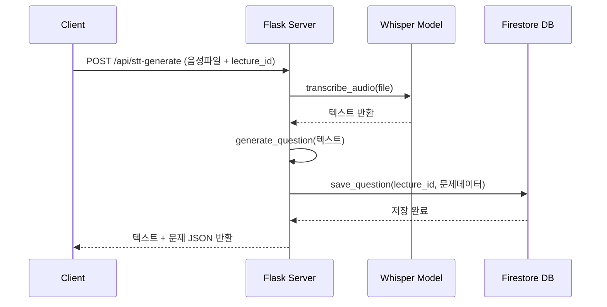

```mermaid
sequenceDiagram
  participant Client
  participant Flask Server
  participant Whisper Model
  participant Firestore DB

  Client->>Flask Server: POST /api/stt-generate (음성파일 + lecture_id)
  Flask Server->>Whisper Model: transcribe_audio(file)
  Whisper Model-->>Flask Server: 텍스트 반환
  Flask Server->>Flask Server: generate_question(텍스트)
  Flask Server->>Firestore DB: save_question(lecture_id, 문제데이터)
  Firestore DB-->>Flask Server: 저장 완료
  Flask Server-->>Client: 텍스트 + 문제 JSON 반환
```
